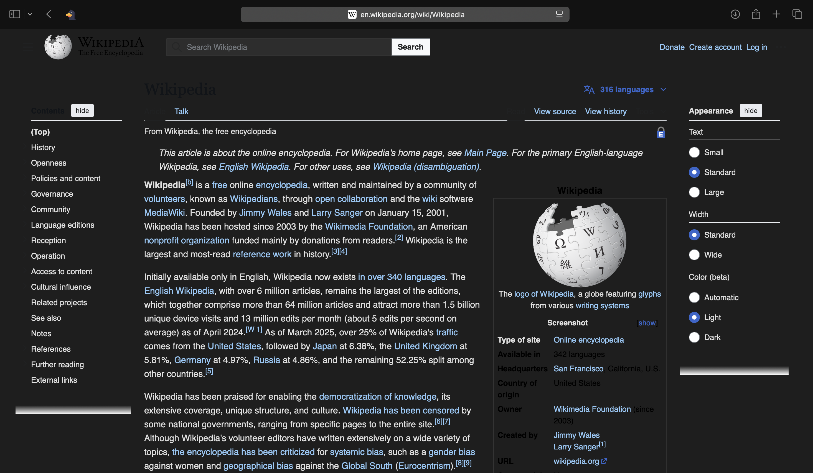
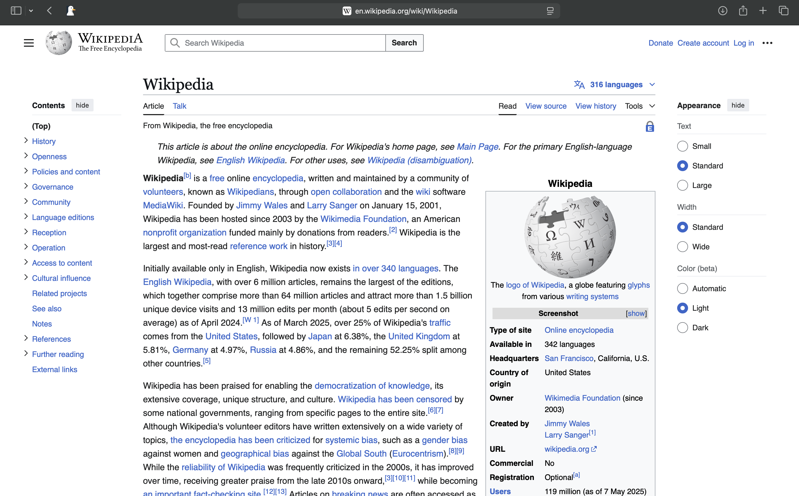

# 🦆 DarkDuck - Safari Dark Mode Extension

**DarkDuck** is a lightweight Safari extension that allows users to toggle dark mode on any website. It provides a clean UI with a simple on/off switch and stores user preferences locally.

## 🚀 Features

- 🌙 Enable or disable dark mode with a single click
- ⚡ Instant toggle without refreshing the page
- 💾 Persistent settings using local storage
- 🔒 Built with App Sandbox for security and data sharing

## 🛠 Installation

1. Clone or download this repository.
2. Open the `.xcodeproj` or `.xcworkspace` file in Xcode.
3. Select your development team under **Signing & Capabilities** for both targets:
   - `DarkDuck` (main app)
   - `DarkDuck Extension` (Safari extension)
4. Build and run the project (`Cmd + R`).
5. Activate the extension in Safari:
   - Safari > Settings > Extensions > Enable **DarkDuck**
  
## 🔧 Prevent Container App Window from Launching
✅ Solution: Set Executable to None
1. Open the **Product > Scheme > Edit Scheme...** menu in Xcode.
2. Select the "**Run**" action from the left panel.
3. In the "**Executable**" section (center panel), click the dropdown.
4. Choose **None**

## DarkDuck On/Off SS

```bash
## 🖼️ DarkDuck





